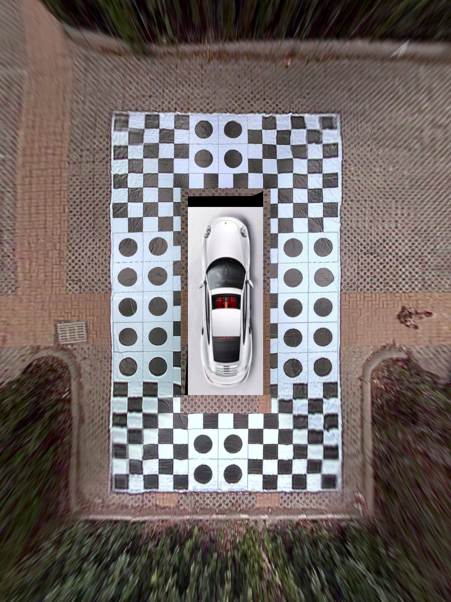

# 360 Surround-View C++ Project
## WeChat&知乎：ADAS之眼


**[个人博客网站传送门](https://jokereyeadas.github.io)**

## Reference Repo

|index|repo|info|
|----|----|----|
|1|[surround-view-system-introduction](https://github.com/neozhaoliang/surround-view-system-introduction)|python verison, refrence repo for 2D avm|
|2|[3d surround-view-system](https://github.com/SokratG/Surround-View)|cuda+opengl verison, for 3d avm|

the project params described doc link:

[surrond view doc](https://github.com/neozhaoliang/surround-view-system-introduction/blob/master/doc/en.md)

## How To Build And Run？
* build

```
#!/bin/bash
mkdir build
cd build 
cmake ..
make
```
* run

```
# make sure data(images amd yaml) path is ../ 
./avm_app ../ #(../ is the image and yaml data path)
```
## Result
|awb and lum banlance disable|awb and lum banlance enable|
|----|----|
|||
