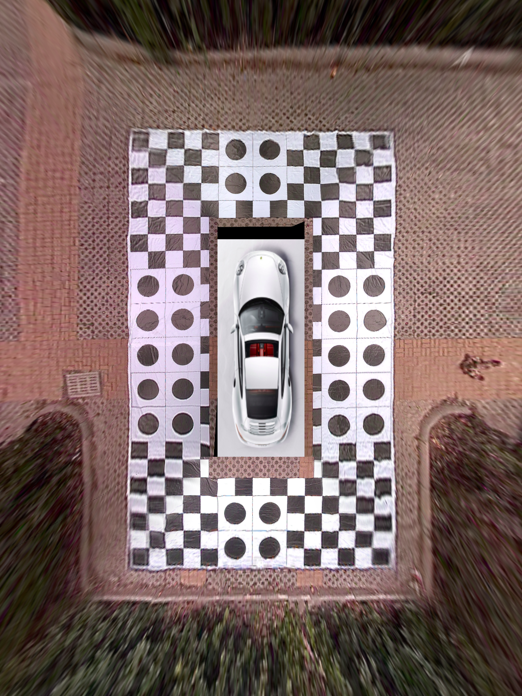

# 360 Surrond-View C++ Project
## WeChat&知乎：ADAS之眼


## Reference Repo

|index|repo|info|
|----|----|----|
|1|[surround-view-system-introduction](https://github.com/neozhaoliang/surround-view-system-introduction)|python verison, refrence repo for 2D avm|
|2|[3d surround-view-system](https://github.com/SokratG/Surround-View)|cuda+opengl verison, for 3d avm|

the project params described doc link:

[surrond view doc](https://github.com/neozhaoliang/surround-view-system-introduction/blob/master/doc/en.md)

## How To Build？

```
#!/bin/bash
mkdir build
cd build 
cmake ..
make
```
## First Verison Demo(awb and lum banlance is not enable)


## TODO:

`add awb and lum banlance`